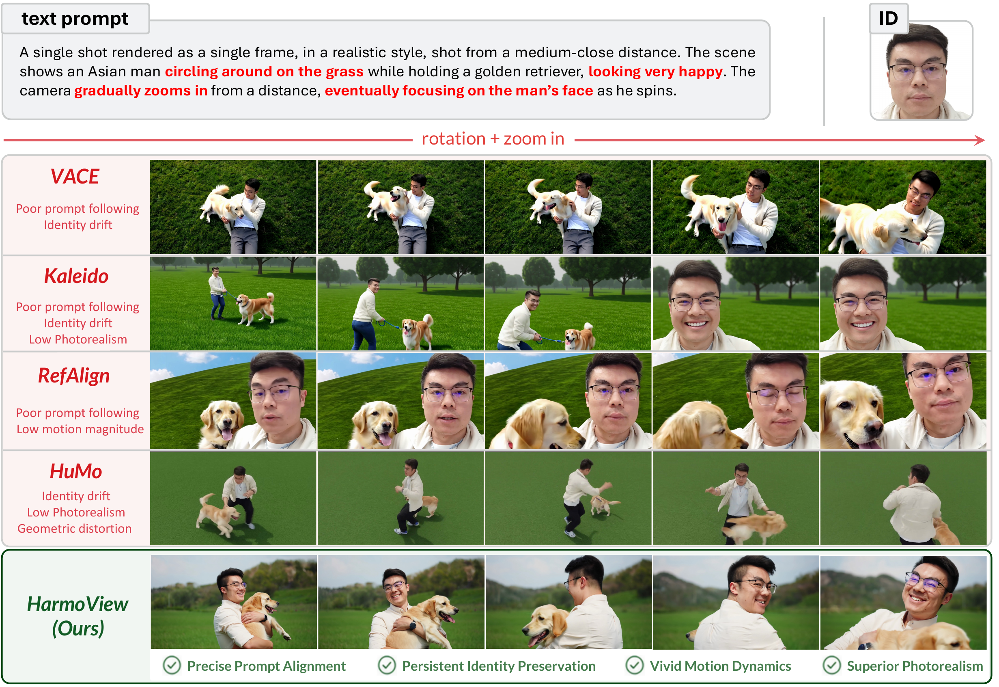

<h1 align="center">HarmoView: Harmonizing Multi-View Constraints<br>for Identity-Consistent Video Generation</h1>

<p align="center">
  <a href="https://arxiv.org/abs/2606.10839"></a>
  <a href="https://conallwang.github.io/HarmoView_Pages/"></a>
</p>

<p align="center">
  Cong Wang, Zhentao Yu, Hongmei Wang, Weicong Liang, Zixiang Zhou,<br>
  Zilin Yang, Jiarong Ou, Rui Chen, Yuan Zhou, Qinglin Lu
  <br><b>Tencent Hunyuan</b>
</p>

---

> **HarmoView** is a robust framework for identity-consistent video generation that effectively integrates
> multi-view reference cues. Built on a pre-trained Wan2.2-T2V backbone, it introduces three synergistic
> architectural refinements — **Multi-level Feature Injection (MFI)**, **Learnable Proxy Tokens (LPT)**, and
> **Jump-RoPE** — complemented by a four-stage **Progressive View Curriculum (PVC)**, to preserve identity
> fidelity under large viewpoint changes.

<p align="center">
  
</p>

## 🔆 Highlights

- **Multi-level Feature Injection (MFI).** Injects raw ViT appearance features from frontal references alongside
  text tokens via cross-attention, providing persistent low-level identity anchors that complement the
  high-level features inside the DiT blocks throughout denoising.
- **Learnable Proxy Tokens (LPT).** Unify heterogeneous single-/multi-view reference layouts and act as
  attention sinks that absorb unmappable features, mitigating the reference–view mismatch problem.
- **Jump-RoPE.** Inserts logical gaps in the rotary positional embeddings to isolate different identities and
  suppress cross-identity feature crosstalk.
- **Progressive View Curriculum (PVC).** A four-stage schedule with view dropout for a stable transition from
  vanilla T2V to high-fidelity, identity-persistent spatial reasoning.

## 📣 News

- **[2026-06-09]** We released the paper on [arXiv](https://arxiv.org/abs/2606.10839) and the [project page](https://conallwang.github.io/HarmoView_Pages/).
- **[2026-06-09]** Inference code and pre-trained weights are coming soon.

## ✅ TODO

- [x] Release the technical report.
- [ ] Release inference code and pre-trained checkpoints.
- [ ] Release HarmoView-Bench (evaluation suite).
- [ ] Release the multi-view data construction pipeline.
- [ ] Release training code.

## 📜 Citation

If you find HarmoView useful for your research, please consider citing:

```bibtex
@article{wang2026harmoview,
  title   = {HarmoView: Harmonizing Multi-View Constraints for Identity-Consistent Video Generation},
  author  = {Wang, Cong and Yu, Zhentao and Wang, Hongmei and Liang, Weicong and
             Zhou, Zixiang and Yang, Zilin and Ou, Jiarong and Chen, Rui and
             Zhou, Yuan and Lu, Qinglin},
  journal = {arXiv preprint arXiv:2606.10839},
  year    = {2026}
}
```
